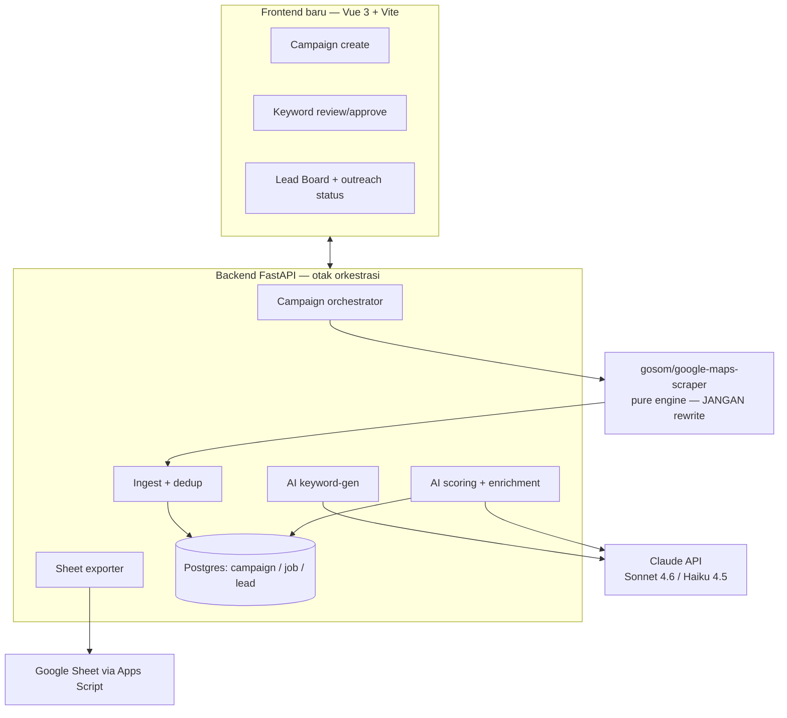
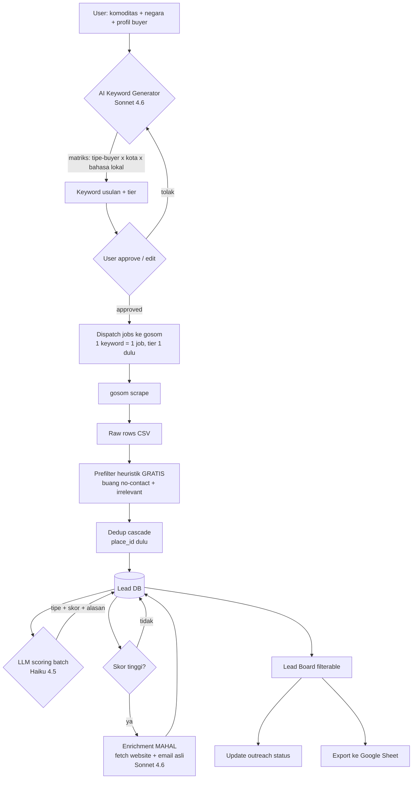
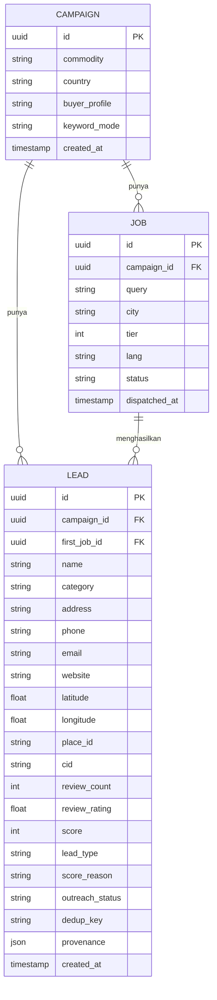
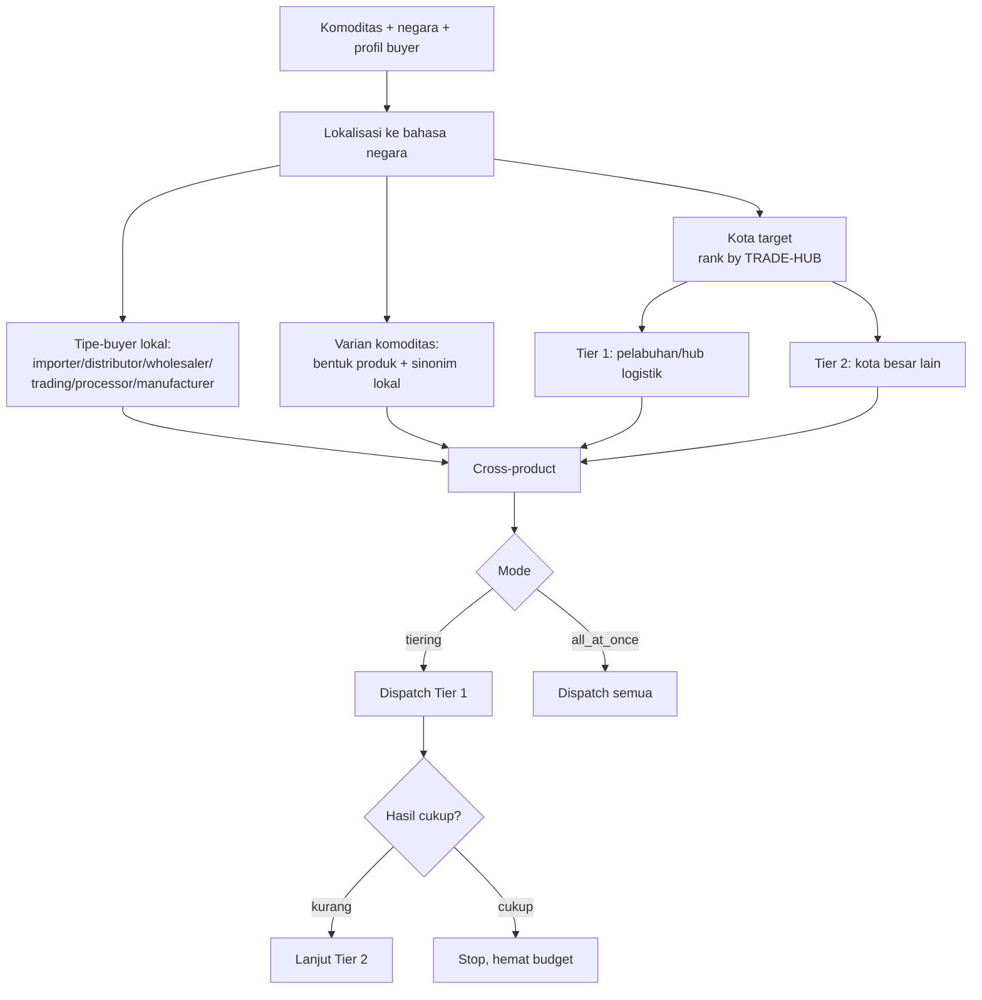
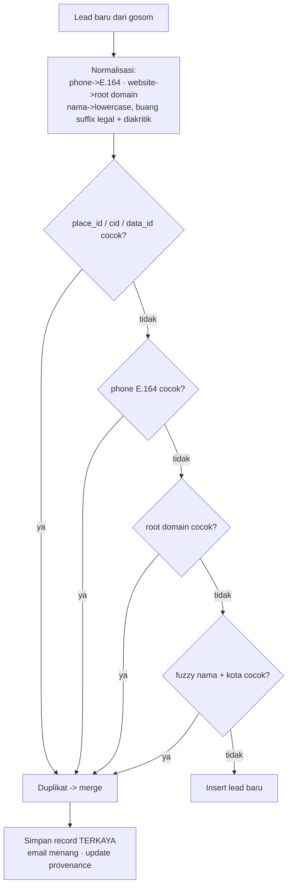
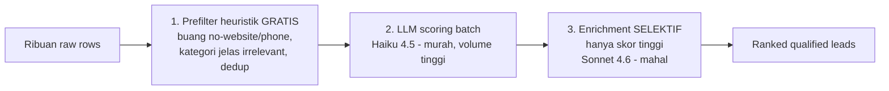
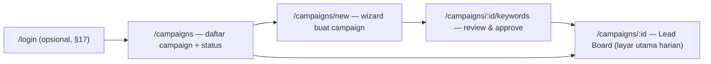
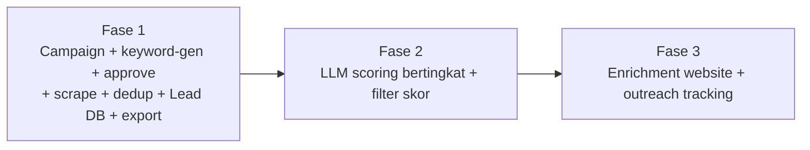

# GMaps Buyer-Finder — Product & Technical Requirements

> **Status:** draft / blueprint · **Audiens:** agent/dev yang akan implement · **Bahasa repo:** campuran ID + istilah teknis EN.
> Dokumen ini = sumber kebenaran untuk arah rewrite. Kalau ada konflik antara dokumen ini
> dan kode lama, ikuti dokumen ini dan catat di bagian _Open Questions_.

## 0. TL;DR

Tool internal untuk bisnis **commodity export**: cari calon **buyer** (importir, distributor,
wholesaler, manufaktur) lewat Google Maps secara semi-otomatis. Alur inti:

`Campaign → AI generate keyword (per kota, bahasa lokal) → user approve → scrape (gosom)
→ dedup → AI scoring → Lead Board (filterable) → export ke Google Sheet`.

AI dipakai di **2 titik bernilai tinggi**: (A) keyword/geo/bahasa expansion, (B) lead scoring.
Selebihnya deterministik (scraping, dedup, storage, export).

---

## 1. Posisi produk (baca dulu sebelum desain)

- GMaps = **top-of-funnel volume tinggi yang murah**, BUKAN satu-satunya channel.
- **Bagus** untuk: importir/distributor lokal, wholesaler, manufaktur pemakai komoditas, HORECA.
- **Lemah** untuk: trading house besar (sering tak punya presence Maps), dan email yang
  ke-scrape sering generic (`info@`) → reply rate rendah.
- **Kualitas hasil ~80% ditentukan di keyword + geografi + bahasa**, bukan di filter belakang.
  Investasi terbesar ada di Keyword Generator (§7), bukan di scoring.
- AI scoring = **prioritisasi/ranking**, bukan verifikasi bahwa mereka benar-benar mengimpor.

---

## 2. Keputusan terkunci (LOCKED)

Jangan diubah tanpa diskusi ulang:

1. **1 campaign = 1 komoditas × 1 negara** (mis. "Green coffee — Germany").
2. **Lead Board default di-scope per campaign**; kota = kolom + filter, bukan campaign terpisah.
   View global lintas-campaign hanya opsional.
3. **gosom/google-maps-scraper TIDAK di-rewrite** — tetap jadi pure scraping engine.
4. **Selalu `AI usul → user approve → dispatch`** — tidak ada scraping otonom penuh.
5. **Storage 1 tabel LEAD untuk semua campaign**, dibedakan `campaign_id` (di-index).
6. **Dedup utama pakai `place_id` (ID kanonik Google)**, bukan nomor HP. Detail §8.
7. **Export: 1 campaign = 1 sheet/tab** di Google Sheet, nama default `"(<NEGARA>) Lead Database"`.
8. **Pipeline biaya bertingkat** (§9): prefilter gratis → LLM murah → enrichment mahal selektif.
9. **Frontend stack = Vue 3** (Vite + TS + Pinia + Vue Router + Tailwind + PrimeVue). Detail §12.

---

## 3. Sistem saat ini (inventory)

| Komponen | Detail |
|---|---|
| `gmaps-scraper` | image `gosom/google-maps-scraper`, port `:8080`, volume `./gmapsdata`, flag `-email`. Engine scraping. |
| `frontend` | nginx `:80`, serve `./public`, proxy `/api/` → scraper, `/api/sheets/` → backend. |
| `backend` | FastAPI `:8000`, env `GOOGLE_SHEET_WEB_APP_URL`. Saat ini **cuma proxy** ke Apps Script. |
| network | docker external network `web`. |

**API gosom (dipakai frontend sekarang):**
- `POST /api/v1/jobs` — body: `{name, keywords[], lang, zoom, depth, max_time, lat?, lon?, radius?, fast_mode, email}`
- `GET /api/v1/jobs` — list job
- `GET /api/v1/jobs/{id}` — status job (`completed|finished|error|failed|running`)
- Output: CSV per job di `./gmapsdata/<job-id>.csv` + state di `jobs.db` (sqlite).

**Kolom CSV gosom (sumber data LEAD):**
`input_id, link, title, category, address, open_hours, popular_times, website, phone,
plus_code, review_count, review_rating, reviews_per_rating, latitude, longitude, cid,
status, descriptions, reviews_link, thumbnail, timezone, price_range, data_id, place_id,
images, reservations, order_online, menu, owner, complete_address, about, user_reviews,
user_reviews_extended, emails`

**File frontend lama:** `public/index.html`, `viewer.html`, `js/scraper.js`, `js/script.js`, `css/style.css`.
Orkestrasi job saat ini ada di client-side JS — akan dipindah ke backend.

**`google_apps_script.js`** — sudah diupgrade: dukung `sheetName` (bikin tab), auto-header, batch (§13).

---

## 4. Arsitektur target



Keputusan effort: gosom dibiarkan; FastAPI ditebelin dari proxy → otak; orkestrasi pindah dari
client ke backend; ganti SQLite gosom dengan Postgres untuk campaign/job/lead.

---

## 5. Pipeline end-to-end



---

## 6. Model data



- Index wajib: `LEAD.campaign_id`, `LEAD.dedup_key`, `LEAD.place_id`.
- `outreach_status` enum: `new | contacted | replied | qualified | rejected | won`.
- `lead_type` enum: `importer | distributor | wholesaler | manufacturer | retailer | irrelevant`.
- `keyword_mode` enum: `tiering` (default) | `all_at_once`.
- `provenance` = daftar `{query, city}` yang pernah menemukan lead ini (sinyal prominence).

---

## 7. Keyword Generator (titik AI #1)

Cross-product `{komoditas} x {tipe-buyer} x {kota}`, semua dalam **bahasa lokal** negara target.
Kota di-rank by **trade-hub** (pelabuhan/hub logistik = tier 1), bukan populasi.



**Kenapa di-guard:** combinatorial meledak (mis. 6 tipe × 20 kota × 2 bahasa = **240 query**),
tiap query = beban scraping + risiko rate-limit. Default `tiering`; `all_at_once` opt-in di form.

**Model:** Sonnet 4.6, temperature rendah, **structured output (tool use)**.

**System prompt (inti):**
- SEMUA query dalam bahasa resmi/bisnis negara target (Jerman→de, UAE→ar+en).
- Rank kota by relevansi trade-hub impor (pelabuhan tier 1), beri alasan per kota.
- Sesuaikan tipe-buyer dengan profil (kalau cuma importer/distributor, JANGAN masukin retail).
- Sertakan sinonim/varian lokal komoditas.
- Cross-product, tier-1 dulu. Output via tool `emit_keywords`, tanpa prosa.

**Tool `emit_keywords` (output):**
```json
{
  "language": "de",
  "buyer_terms": ["Importeur", "Großhändler", "Distributor", "Handelsunternehmen"],
  "commodity_terms": ["Rohkaffee", "grüner Kaffee", "Kaffeebohnen"],
  "cities": [
    { "name": "Hamburg", "tier": 1, "reason": "pelabuhan terbesar / hub kopi" },
    { "name": "Bremen",  "tier": 1, "reason": "pelabuhan / trade hub kopi" },
    { "name": "München", "tier": 2, "reason": "pasar besar pedalaman" }
  ],
  "queries": [
    { "query": "Rohkaffee Importeur Hamburg", "city": "Hamburg", "tier": 1 }
  ]
}
```
`queries` dipecah per `city`+`tier` agar UI bisa grup per tier & backend dispatch bertahap.

---

## 8. Dedup (cascade, bukan HP saja)



- `place_id` menyelesaikan ~95% duplikat lintas-query secara eksak.
- Saat merge: pertahankan record paling lengkap, tambahkan `{query,city}` ke `provenance`.
- **Franchise/multi-cabang** (domain sama, place_id beda): default = lead terpisah, sediakan
  opsi grouping by domain di UI.

---

## 9. Scoring & enrichment (titik AI #2) + pipeline biaya



**Scoring prompt (Haiku 4.5, batch banyak lead/1 panggilan):**
- Input per lead: `name, category, ada_website, ada_email, review_count, country, city` + konteks `commodity, buyer_profile`.
- Output per lead: `lead_type` (enum §6), `score` 0–100, `score_reason` (1 kalimat).
- Rubrik skor (panduan): kecocokan kategori & nama dengan tipe-buyer target (paling berat),
  punya website/email (+), sinyal B2B/wholesale di nama (+), tampak retail kecil/end-consumer (−),
  jelas irrelevant → skor rendah + `lead_type=irrelevant`.
- **Jangan** jalankan LLM ke raw row sebelum prefilter+dedup.

**Enrichment (Sonnet 4.6, hanya lead skor ≥ threshold):** fetch website, ringkas "mereka jual/butuh apa",
cari email asli (bukan generic), boleh revisi skor.

---

## 10. Field mapping gosom CSV → LEAD

| gosom CSV | LEAD | Catatan |
|---|---|---|
| `title` | `name` | |
| `category` | `category` | sinyal scoring utama |
| `complete_address` / `address` | `address` | pakai `complete_address` jika ada |
| `phone` | `phone` | normalisasi E.164 untuk dedup |
| `website` | `website` | normalisasi root domain untuk dedup |
| `emails` | `email` | bisa multi → ambil pertama / simpan semua |
| `latitude`,`longitude` | `latitude`,`longitude` | |
| `place_id` / `cid` / `data_id` | `place_id`,`cid` | **kunci dedup utama** |
| `review_count`,`review_rating` | `review_count`,`review_rating` | sinyal scoring |
| `link` | (opsional `gmaps_url`) | |
| — | `score`,`lead_type`,`score_reason` | diisi tahap scoring |
| — | `outreach_status` | default `new` |
| — | `dedup_key`,`provenance` | diisi tahap ingest/dedup |

---

## 11. Backend API surface (usulan)

| Method · Path | Fungsi |
|---|---|
| `POST /api/campaigns` | Buat campaign (commodity, country, buyer_profile, keyword_mode). |
| `POST /api/campaigns/{id}/keywords` | Jalankan keyword-gen (LLM) → balikin usulan query+tier. |
| `POST /api/campaigns/{id}/dispatch` | Terima query yang di-approve → buat JOB → dispatch ke gosom (tier-aware). |
| `GET /api/campaigns/{id}/jobs` | Status semua job. |
| `POST /api/jobs/{id}/ingest` *(internal)* | Tarik CSV gosom → prefilter → dedup → insert LEAD. |
| `POST /api/campaigns/{id}/score` | Scoring batch lead (LLM). |
| `GET /api/campaigns/{id}/leads` | Lead terfilter: `?score_gte=&type=&city=&status=&has_email=`. |
| `PATCH /api/leads/{id}` | Update `outreach_status`. |
| `POST /api/campaigns/{id}/export` | Build rows → POST ke Apps Script (lihat §13). |

Endpoint Sheet lama `POST /api/sheets/add` tetap ada (diteruskan ke Apps Script).

---

## 12. Frontend — Vue 3 (recreate UI/UX)

> Ini akan jadi **alat harian** bisnis. Prioritas: **clean, intuitif, cepat dipakai berulang**.
> Recreate dari nol — file lama (`public/*.html`, vanilla JS) di-deprecate, bukan dimodifikasi.

### 12.1 Stack (LOCKED, lihat §2.9)
- **Vue 3** (Composition API, `<script setup>`) + **Vite** + **TypeScript**.
- **Pinia** (state), **Vue Router** (routing), **Tailwind CSS** (layout/spacing/tokens).
- **PrimeVue** untuk komponen berat — terutama **DataTable** (filter/sort/pagination/row-expand/
  row-selection sudah built-in, persis kebutuhan Lead Board). Alternatif headless: TanStack Table (Vue).
- **VeeValidate + Zod** untuk form & validasi. **Axios** (atau `@tanstack/vue-query`) untuk data fetching + caching.

### 12.2 Prinsip desain (non-negotiable untuk daily use)
- **Clean & low-noise:** banyak whitespace, 1 aksi primer per layar, hierarki jelas. Hindari UI ramai.
- **Setiap async state eksplisit:** `loading` (skeleton, bukan spinner kosong) · `empty` (ilustrasi + CTA) ·
  `error` (pesan + tombol retry) · `success` (toast singkat). Tidak ada layar diam tanpa feedback.
- **Optimistic update** untuk aksi ringan (ubah outreach status) + rollback kalau gagal.
- **Filter & sort Lead Board persist** (URL query / localStorage) — balik lagi, state tetap.
- **Keyboard-friendly:** `/` fokus search, panah navigasi baris, shortcut bulk-action.
- **Konsisten:** 1 design token set (warna, radius, spacing, font). Status pakai warna konsisten
  (new=netral, contacted=biru, qualified=hijau, rejected=merah, won=emas).
- **Desktop-first** (tool kerja, tabel padat), tapi tetap usable di laptop kecil.

### 12.3 Route map


### 12.4 Struktur komponen (ringkas)
- `layouts/AppShell.vue` — sidebar (Campaigns, settings) + topbar (search global, akun).
- `pages/CampaignList.vue` — kartu/baris campaign: komoditas, negara, jumlah lead, progress scraping.
- `pages/CampaignWizard.vue` — Layar 1 (§ mockup di bawah), form bertahap.
- `pages/KeywordReview.vue` — Layar 2: list keyword grouped per tier, checkbox, tambah manual.
- `pages/LeadBoard.vue` — Layar 3: `<DataTable>` PrimeVue (filter, sort, selection, row-expand).
- Komponen: `LeadStatusBadge`, `ScoreBadge`, `FilterBar`, `BulkActionMenu`, `LeadDetailDrawer`,
  `JobProgress` (live status scraping), `ExportSheetDialog` (form nama sheet).
- `stores/` Pinia: `campaign`, `lead`, `keyword`, `job`. `composables/`: `useLeadFilters`, `useExport`.

### 12.5 Catatan UX spesifik
- **Progress scraping** harus live & jelas: campaign yang lagi scrape tampil progress per tier/job
  (poll `GET /campaigns/:id/jobs`), bukan cuma "loading...". Lead masuk bertahap ke board.
- **Keyword Review** menonjolkan **Tier 1 dulu**, Tier 2 di accordion terpisah; tampilkan estimasi
  jumlah query yang akan dispatch sebelum user klik (biar sadar beban/biaya).
- **Lead Board** = pusat kerja harian: row-expand nampilin `score_reason` + enrichment; bulk-select
  → export / set status; badge skor berwarna; kolom kota selalu bisa difilter.
- **Export** lewat dialog: nama sheet prefilled `"(<NEGARA>) Lead Database"`, editable, plus preview
  jumlah lead yang akan diekspor.

### 12.6 Mockup layar

**Layar 1: Campaign create**
```
┌─ New Campaign ──────────────────────────────┐
│ Komoditas:      [ green coffee beans      ▾] │
│ Pasar target:   [ Germany                 ▾] │
│ Profil buyer:   [x] Importer  [x] Distributor │
│                 [ ] Retailer/HORECA           │
│ Mode keyword:   (•) Tiering (hemat)           │
│                 ( ) Gas semua sekaligus       │
│                          [ Generate Keyword ] │
└──────────────────────────────────────────────┘
```

**Layar 2: Keyword review (approve sebelum dispatch, grup per tier)**
```
┌─ Keyword usulan AI — Tier 1 dulu ────────────┐
│ [x] Rohkaffee Importeur Hamburg               │
│ [x] Kaffee Großhändler Bremen                 │
│ [x] Green coffee distributor Hamburg          │
│ [ ] Kaffee Einzelhandel München  (di-uncheck) │
│ ...                              (48 keyword) │
│           [ + Tambah manual ]  [ Dispatch → ] │
└──────────────────────────────────────────────┘
```

**Layar 3: Lead Board (tabel filterable — layar utama)**
```
┌─ Filters ─────────────────────────────────────────────────────┐
│ Skor ≥ [70]  Tipe [Importer▾] Kota [All▾] Status [New▾] ☑Email │
├────┬──────────────────────┬──────────┬──────┬───────┬──────────┤
│ ▢  │ Nama                 │ Tipe     │ Skor │ Kota  │ Status   │
├────┼──────────────────────┼──────────┼──────┼───────┼──────────┤
│ ▢  │ Hamburg Coffee Imp.  │ Importer │  92  │ HH    │ New      │
│ ▢  │ Nordkaffee GmbH      │ Distrib. │  85  │ Bremen│ Contacted│
└────┴──────────────────────┴──────────┴──────┴───────┴──────────┘
 [Bulk ▾: Export ke Sheet | Set status]   ↓ expand row → alasan AI + enrichment
```
Row expand: `score_reason` + ringkasan website + email asli. Tabel: **PrimeVue DataTable** (§12.1).

---

## 13. Export ke Google Sheet (1 campaign = 1 sheet)

`google_apps_script.js` sudah diupgrade:
- `sheetName` → bikin tab kalau belum ada (default `"(<NEGARA>) Lead Database"`), fallback active sheet.
- Auto-header + freeze row 1 saat sheet kosong.
- **Batch** via `setValues` (terima array `rows`), tetap back-compat single object.

> ⚠️ Setelah edit Apps Script WAJIB re-deploy (New version). URL tidak berubah.
> Backend FastAPI tidak perlu diubah — `/api/sheets/add` forward JSON apa adanya.

```mermaid
flowchart LR
    LB[Lead Board: filter lead\nmis. skor >= 70] --> BTN[Tombol Export to Sheet]
    BTN --> FORM[Form nama sheet\nprefill '(UAE) Lead Database' — editable]
    FORM --> BE[Backend kumpulin lead -> rows array]
    BE --> AS[POST /api/sheets/add -> Apps Script]
    AS --> TAB[Tab baru / append ke tab campaign]
```

**Payload Apps Script:** `{ "sheetName": "...", "rows": [ { companyName, phone, email, country, city, address, date?, ... } ] }`

**Schema kolom sheet (CRM-style, existing):** No, Tanggal, Nama Perusahaan, PIC, Jabatan,
No Handphone, Email, Negara, Kota, Alamat, Account Executive, Noted.
GMaps isi yang bisa (Nama/HP/Email/Negara/Kota/Alamat); kolom manual (PIC/Jabatan/AE/Noted)
dibiarkan kosong untuk diisi tim. Re-export ke sheet sama = **append** (tidak replace).

---

## 14. Phasing & acceptance



- **Fase 1 (game-changer):** bisa buat campaign, generate+approve keyword, dispatch ke gosom,
  ingest+dedup ke Lead DB, lihat di Lead Board, export 1 campaign → 1 sheet. *Belum ada AI scoring.*
- **Fase 2:** scoring Haiku 4.5 + kolom skor/tipe + filter by skor di board.
- **Fase 3:** enrichment selektif Sonnet 4.6 + outreach status workflow penuh.

---

## 15. Non-goals (di luar scope)

- Bukan CRM penuh (pipeline deal, email sequencing). Outreach status hanya penanda ringan.
- Bukan multi-source (Alibaba/LinkedIn/customs data) — GMaps only untuk sekarang.
- Tidak auto-kirim email ke lead. Export ke Sheet/CRM, outreach manual oleh tim.
- Tidak rewrite gosom.

---

## 16. Risiko & catatan jujur

- GMaps = top-of-funnel; channel lebih "panas": trade/customs data (ImportGenius, Panjiva, Volza),
  B2B directory, LinkedIn. Pertimbangkan nanti.
- Email GMaps sering generic → reply rate rendah; enrichment membantu sebagian.
- AI scoring = prioritisasi, bukan verifikasi importir.
- Risiko rate-limit / IP block gosom saat scrape skala besar (tradeoff `fast_mode`); itu alasan tiering.

---

## 17. Open questions

- [ ] Threshold skor untuk trigger enrichment & untuk default export (sementara asumsi ≥ 70)?
- [ ] Franchise multi-cabang: default lead terpisah — sudah final?
- [ ] Berapa target lead/campaign & campaign/bulan (mempengaruhi keputusan Postgres vs SQLite)?
- [ ] `email` multi-value: ambil pertama atau simpan semua?
- [ ] Auth/multi-user untuk tool internal ini perlu nggak?
